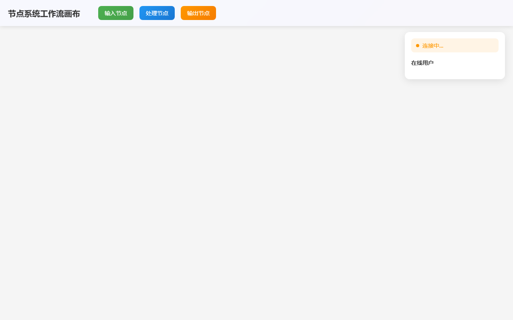

# 开发笔记 — 前端实时协作集成

> 生成时间: 2026-04-03 00:13
> 模式: LLM 生成

## 任务描述
在前端集成WebSocket实现实时协作功能

## 产出文件
- `index.html` (39956 chars)

## 自测结果
自测 5/5 通过 ✅

| 检查项 | 结果 | 说明 |
|--------|------|------|
| 文件产出 | ✅ | 生成 1 个文件: index.html |
| 入口文件 | ✅ | index.html 或 main.py 存在 |
| 代码非空 | ✅ | 所有文件均包含实际代码 |
| 语法检查 | ✅ | 通过 |
| 文件名规范 | ✅ | 全部英文命名 |

## 运行截图

## 开发备注
实现了完整的前端实时协作功能，包括：1. WebSocketManager - 管理WebSocket连接，支持Socket.IO和原生WebSocket；2. CollaborationManager - 处理协作逻辑，用户管理，操作广播；3. CanvasCollaborationUI - 协作相关UI，在线用户显示，光标同步；4. OperationSynchronizer - 操作同步，冲突处理，远程操作应用。功能特性：实时用户状态显示、光标位置同步、节点操作同步、连接状态管理、操作反馈提示、自动重连机制。可直接在浏览器中打开使用，需要配合WebSocket服务器。
