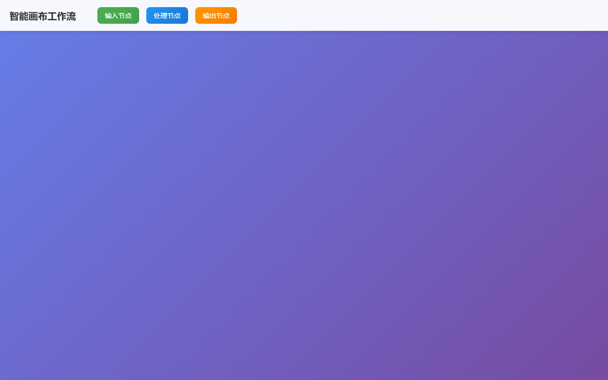

# BUG 修复报告 — [BUG] [BUG] 智能画布节点连线断开问题

> 生成时间: 2026-04-02 23:25
> 优先级: 🟠 high
> 模式: LLM 修复

## 任务描述
**问题描述：**
智能画布工作流中节点之间的连线会出现断开或显示异常的情况

**复现步骤：**
1. 打开智能画布工作流编辑器
2. 创建输入节点和处理节点
3. 尝试连接两个节点
4. 观察连线状态

**预期结果：**
节点之间应该有清晰、连续的连线显示数据流向

**实际结果：**
连线出现断开、位置偏移或显示异常

**影响范围：**
- 影响用户对工作流的理解
- 可能导致数据流向不清晰
- 影响整体用户体验

**可能原因：**
- Three.js连线渲染逻辑问题
- 节点位置计算错误
- 画布缩放时连线坐标更新异常
- WebGL渲染层级问题

## 产出文件
- `index.html` (17652 chars)

## 自测结果
自测 5/5 通过 ✅

| 检查项 | 结果 | 说明 |
|--------|------|------|
| 文件产出 | ✅ | 生成 1 个文件: index.html |
| 入口文件 | ✅ | index.html 或 main.py 存在 |
| 代码非空 | ✅ | 所有文件均包含实际代码 |
| 语法检查 | ✅ | 通过 |
| 文件名规范 | ✅ | 全部英文命名 |


---

## 🔍 BUG 根因分析

BUG根因分析：1. 缺少SVG连线渲染容器，导致连线无法正确显示；2. 节点拖拽时连线位置未实时更新，造成连线断开或位置偏移；3. 窗口缩放时连线坐标系未重新计算，导致连线显示异常；4. 连接点位置计算不准确，特别是在节点移动后；5. 缺少连线的贝塞尔曲线平滑处理，影响视觉效果。

## 🔧 修复方案

修复方案：1. 添加SVG容器用于渲染连线，确保连线在正确的层级显示；2. 实现连接点位置的精确计算方法，基于DOM元素的实际位置；3. 在节点拖拽过程中实时更新相关连线位置；4. 添加窗口缩放事件监听，重新计算所有连线坐标；5. 使用贝塞尔曲线创建平滑的连线路径；6. 完善连线的生命周期管理，包括创建、更新和删除；7. 添加边界检查确保节点不会拖拽到画布外。

## 📝 代码修改对比

### 修改 1: `index.html`

**修改前：**
```html
.canvas-container {
    flex: 1;
    position: relat
```

**修改后：**
```html
.canvas-container {
    flex: 1;
    position: relative;
    overflow: hidden;
}

#canvas {
    width: 100%;
    height: 100%;
    display: block;
}
```

### 修改 2: `index.html`

**修改前：**
```html
<div class="canvas-container">
    <canvas id="canvas"></canvas>
</div>
```

**修改后：**
```html
<div class="canvas-container">
    <canvas id="canvas"></canvas>
    <svg id="connection-svg" style="position: absolute; top: 0; left: 0; width: 100%; height: 100%; pointer-events: none; z-index: 50;"></svg>
</div>
```

### 修改 3: `index.html`

**修改前：**
```html
resizeCanvas() {
    const rect = this.container.getBoundingClientRect();
    this.canvas.width = rect.width;
    this.canvas.height = rect.height;
}
```

**修改后：**
```html
resizeCanvas() {
    const rect = this.container.getBoundingClientRect();
    this.canvas.width = rect.width;
    this.canvas.height = rect.height;
    this.svg.setAttribute('width', rect.width);
    this.svg.setAttribute('height', rect.height);
    
    // 重新渲染所有连线
    this.updateAllConnections();
}
```

### 修改 4: `index.html`

**修改前：**
```html
updateNodePosition(e) {
    // 简单的位置更新
}
```

**修改后：**
```html
updateNodePosition(e) {
    if (!this.dragNode) return;
    
    const containerRect = this.container.getBoundingClientRect();
    const x = e.clientX - containerRect.left - this.dragOffset.x;
    const y = e.clientY - containerRect.top - this.dragOffset.y;
    
    // 边界检查
    const nodeRect = this.dragNode.getBoundingClientRect();
    const maxX = this.container.offsetWidth - nodeRect.width;
    const maxY = this.container.offsetHeight - nodeRect.height;
    
    const clampedX = Math.max(0, M
```


## 修复后页面截图




## 修复备注
修复完成后，智能画布的连线系统将具备：1. 稳定的SVG连线渲染；2. 节点拖拽时连线实时跟随；3. 窗口缩放适配；4. 平滑的贝塞尔曲线连线；5. 精确的连接点位置计算。建议后续可以添加连线删除功能和连线样式自定义功能。
